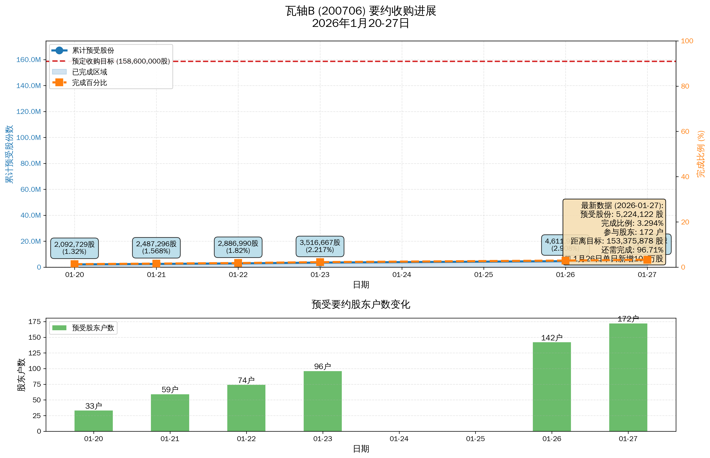
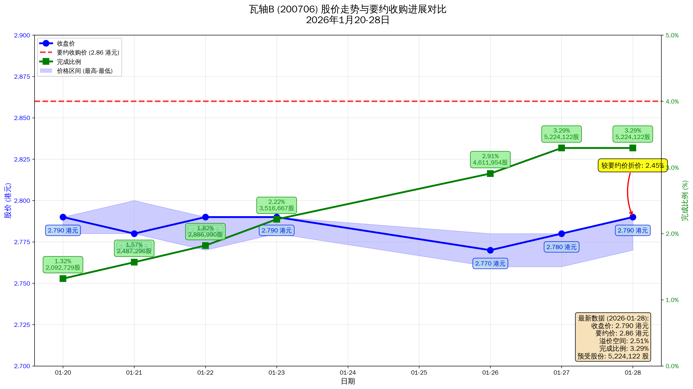
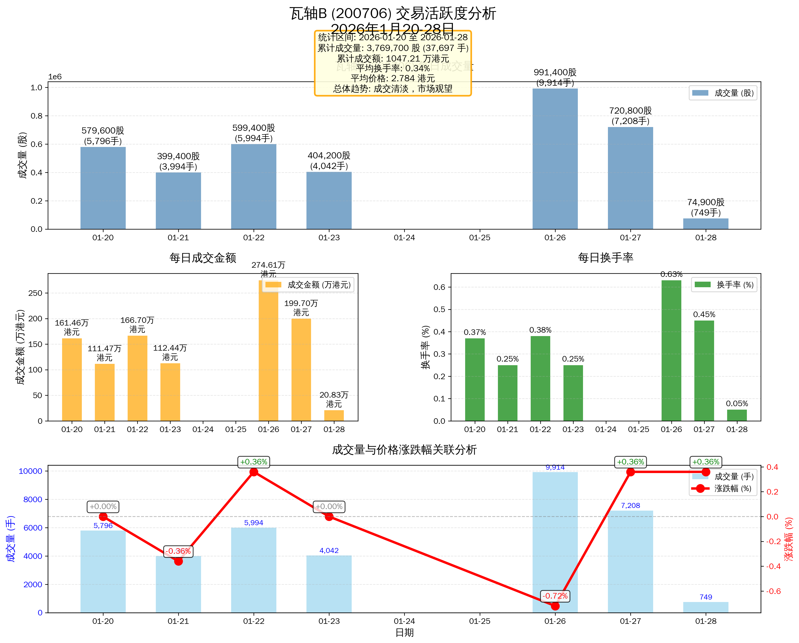

# 瓦轴B要约收购信息汇总

---

## 🚨 重要更新（2026年1月28日）

⚠️ **控股股东确认：要约价格不会上调** | 📈 **完成率加速上升至3.294%**

**最新进展**：
- **完成率突破3%**：从1.82%（1月22日）快速上升至3.294%（1月27日）
- **1月26日爆发**：单日新增109.6万股，是日均的2-3倍
- **参与户数激增**：从74户增至172户（增长132%）
- **首次出现撤回**：1月26日有2户撤回1,100股（金额极小）

**关键影响**：
- 要约价格固定为 2.86港元/股，不会上调
- 理论套利空间锁定在 2.88%（扣除成本后净收益约2.16%）
- **尽管加速，但距离目标仍需33,825,878股（还需96.706%）**
- **投资建议维持：潜在投资者应完全放弃**
- **已持有者：立即预受要约，这是最佳退出机会**

详见：[投资策略与收益深度分析](reports/investment_strategy_insights.md)

---

## 基本信息

- **股票名称**: 瓦轴B
- **股票代码**: 200706
- **收购方**: 瓦房店轴承集团有限责任公司(控股股东)
- **公告时间**: 2024年12月17日
- **复牌时间**: 2024年12月18日

## 要约收购详情

### 收购价格与规模

- **要约收购价格**: 2.86港元/股
  - 该价格等于2024年12月15日的收盘价

- **要约收购股份数量**: 15,860万股
  - 占总股本比例: 39.39%

- **所需资金**: 约4.54亿港元

### 收购条件

要约收购生效需满足以下条件:
- 要约收购完成后,社会公众股持股比例低于总股本的10%
- 需要至少3,905万股接受要约才能达成上述条件

### 收购目的

本次要约收购的目的是**终止公司上市地位**,实现B股私有化退市。

## 公司背景

### 经营情况

- **持续亏损**: 从2019年至2024年,瓦轴B连续每年报告净亏损
- **控股股东情况**: 瓦房店轴承集团自身在2022-2024年连续三年亏损
- **最新业绩**: 控股股东在2025年前9个月恢复盈利

### 行业背景

这是**两年来首个B股私有化案例**:
- 上一个B股私有化案例是2023年的山航B
- B股市场私有化退市案例相对罕见

## 市场意义

1. **B股退市趋势**: 反映了B股市场整体萎缩和退市趋势
2. **私有化动机**: 长期亏损企业通过私有化退市降低上市成本
3. **控股股东策略**: 控股股东在自身业绩改善后推动子公司退市

## 关键时间节点

- **2024年12月16日**: 股票停牌,筹划要约收购事项
- **2024年12月17日**: 发布要约收购报告书摘要
- **2024年12月18日**: 股票复牌

---

## 要约收购进展数据

### 预受要约统计（截至2026年01月27日）

#### 非流通股

| 项目 | 户数 | 股数 |
|------|------|------|
| 当天预受 | 0 | 0 |
| 当天撤回预受 | 0 | 0 |
| 截至当天累计预受 | 0 | 0 |
| **净预受股份比例** | - | **0%** |

#### 流通股

| 项目 | 户数 | 股数 |
|------|------|------|
| 当天预受 | 31 | 612,168 |
| 当天撤回预受 | 0 | 0 |
| 截至当天累计预受 | 172 | 5,224,122 |
| **净预受股份比例** | - | **3.294%** |

### 近期预受进展（完整数据）

| 日期 | 新增户数 | 新增股数 | 撤回股数 | 累计户数 | 累计股数 | 完成比例 | 备注 |
|------|---------|---------|---------|---------|---------|---------|------|
| 2026-01-20 | 33 | 2,092,729 | 0 | 33 | 2,092,729 | 1.32% | 首日 |
| 2026-01-21 | 26 | 394,567 | 0 | 59 | 2,487,296 | 1.568% | - |
| 2026-01-22 | 15 | 399,694 | 0 | 74 | 2,886,990 | 1.82% | - |
| 2026-01-23 | 22 | 629,677 | 0 | 96 | 3,516,667 | 2.217% | 突破2% |
| 2026-01-26 | 50 | 1,096,387 | **1,100** | 142 | 4,611,954 | 2.908% | **爆发日** |
| 2026-01-27 | 31 | 612,168 | 0 | 172 | 5,224,122 | 3.294% | **突破3%** |

**要约收购分析**：

**🚀 重大突破**：
- 截至2026年1月27日，累计有172户股东预受要约，预受股份数为5,224,122股
- **完成比例达到3.294%**，一周内从1.32%上升至3.294%（增长149%）
- **1月26日关键转折**：单日新增109.6万股，是日均的2-3倍
- 参与户数从33户激增至172户（增长421%）

**⚠️ 首次撤回**：
- 1月26日首次出现撤回：2户撤回1,100股
- 撤回金额极小（约3,146港元），占比仅0.024%
- 可能是个别投资者的策略调整，不影响整体趋势

**📊 进度分析**：
- 距离要约收购生效所需的最低预受比例（需降低公众持股至10%以下）还需约33,825,878股
- 还需完成96.706%
- 近期日均新增约63万股（较初期40万股提速57%）
- 按当前加速后的速度，约需54天才能达标（仍超一般要约期限）

**💡 趋势判断**：
- ✅ 增速明显加快，市场信心略有改善
- ✅ 参与户数大幅增加，覆盖面扩大
- ⚠️ 但绝对完成率仍然很低（仅3.294%）
- ⚠️ 距离成功仍需大幅提升

---

## 交易行情数据

### 近期交易汇总（2026年01月20-28日）

| 日期 | 开盘 | 收盘 | 最高 | 最低 | 涨跌幅 | 成交量(手) | 成交额(万港元) | 换手率 | 备注 |
|------|------|------|------|------|--------|-----------|--------------|--------|------|
| 01-20 | 2.790 | 2.790 | 2.790 | 2.780 | 0.00% | 5,796 | 161.46 | 0.37% | - |
| 01-21 | 2.790 | 2.780 | 2.800 | 2.780 | -0.36% | 3,994 | 111.47 | 0.25% | - |
| 01-22 | 2.790 | 2.790 | 2.790 | 2.770 | +0.36% | 5,994 | 166.70 | 0.38% | - |
| 01-23 | 2.780 | 2.790 | 2.790 | 2.780 | 0.00% | 4,042 | 112.44 | 0.25% | - |
| 01-26 | 2.780 | 2.770 | 2.780 | 2.760 | -0.72% | 9,914 | 274.61 | **0.63%** | **放量** |
| 01-27 | 2.760 | 2.780 | 2.780 | 2.760 | +0.36% | 7,208 | 199.70 | 0.45% | - |
| 01-28 | 2.770 | 2.790 | 2.790 | 2.770 | +0.36% | 749 | 20.83 | **0.05%** | **缩量** |
| **累计** | - | - | **2.800** | **2.760** | **0.00%** | **37,697** | **1,047.21** | **2.38%** | 7个交易日 |

### 最新交易日详情（2026年01月28日）

| 指标 | 数据 |
|------|------|
| 开盘价 | 2.770港元 |
| 收盘价 | 2.790港元 |
| 最高价 | 2.790港元 |
| 最低价 | 2.770港元 |
| 涨跌额 | +0.010港元 |
| 涨跌幅 | +0.36% |
| 成交量 | 749手 (74,900股) |
| 成交金额 | 20.83万港元 |
| 换手率 | **0.05%** |

**市场表现分析**：

**📊 价格走势**：
- 7日在2.760-2.800港元区间窄幅震荡，振幅仅1.43%
- 收盘价回到2.790港元，与初期持平
- **折价幅度**：2.79港元较要约价2.86港元折价2.45%
- **套利空间**：理论套利空间约2.51%（扣除交易成本后约1.8%）

**💹 成交量分析（关键变化）**：
- **1月26日放量**：9,914手，换手率0.63%，是平均水平的2倍
  - 对应要约收购单日新增109万股，量价配合
  - 成交额274.61万港元，为期间最高

- **1月28日急剧萎缩**：仅749手，换手率0.05%，暴跌92%
  - 成交额仅20.83万港元，创新低
  - 可能是周前观望或春节前资金谨慎

- **7日累计**：37,697手，成交额1,047万港元
  - 日均换手率0.34%，依然极低
  - 对比正常市场（2-5%），仍不到正常水平的1/7

**🔍 量价关系**：
- 1月26日：大幅放量（+66%）+ 下跌0.72% = 恐慌性抛售？
- 1月27日：回调放量（+45%）+ 上涨0.36% = 部分买盘
- 1月28日：极度缩量（-90%）+ 上涨0.36% = 观望为主

**💡 市场态度**：
- 尽管存在2.45%套利空间，但参与度依然极低
- 预受加速未带来持续的交易活跃
- 大部分投资者仍在观望，等待更明确信号
- 1月28日的极度萎缩显示市场信心依然不足

---

## 数据可视化分析

### 1. 要约收购进展趋势图

**图表说明**：
- **上半部分**：显示累计预受股份数量（蓝色）与完成比例（橙色）的双轴图
- **下半部分**：显示参与预受要约的股东户数变化

**关键发现**：
1. **增速显著加快**：7日累计新增522万股，日均约63万股（较初期40万股提速57%）
2. **完成率突破3%**：从1.32%快速上升至3.294%（一周内增长149%）
3. **1月26日关键转折**：单日新增109.6万股，是日均的2-3倍，伴随成交量放大
4. **参与度大幅改善**：股东户数从33户激增至172户（增长421%）
5. **首次出现撤回**：1月26日有2户撤回1,100股，但金额极小（0.024%）
6. **时间仍然紧迫**：按加速后速度需约54天达标，仍超一般要约期限
7. **但绝对水平仍低**：完成率仅3.294%，距离目标还需96.706%

### 2. 股价与预受股份对比分析

**图表说明**：
- **蓝色区域**：股价日内波动区间（最高-最低）
- **蓝色实线**：收盘价走势
- **红色虚线**：要约收购价2.86港元
- **绿色实线**：要约收购完成比例

**关键发现**：
1. **持续折价交易**：7日收盘价在2.77-2.79港元区间，较要约价2.86港元折价2.45-3.15%
2. **套利空间稳定**：理论套利空间维持在2.45-3.15%区间，但市场反应分化
3. **1月26日量价异动**：
   - 股价跌0.72%至2.770港元（创新低），折价扩大至3.15%
   - 成交量放大至9,914手（+66%），换手率0.63%
   - 同日预受新增109万股（爆发）
   - 量价背离：抛压增加但预受加速
4. **预受加速增长**：完成比例从1.32%→3.294%，7日增长149%
5. **1月28日异常缩量**：成交仅749手，换手率0.05%，预受数据未公布
6. **套利部分激活**：增速加快表明部分投资者开始参与，但整体仍谨慎

### 3. 交易活跃度综合分析

**图表说明**：
- **第一部分**：每日成交量（股）
- **第二部分**：每日成交金额（万港元）
- **第三部分**：每日换手率
- **第四部分**：成交量与价格涨跌幅的关联分析

**关键发现**：
1. **交易量剧烈波动**：
   - 平稳期（1月20-23日）：日均4,707手，换手率0.31%
   - **1月26日爆发**：9,914手，换手率0.63%，成交额274.61万港元
     - 是平均水平的2倍
     - 对应预受新增109万股
   - 1月27日回落：7,208手，换手率0.45%
   - **1月28日暴跌**：仅749手，换手率0.05%，成交额20.83万港元
     - 较前日暴跌90%
     - 创观察期新低

2. **换手率依然极低**：
   - 7日平均换手率0.34%，远低于正常水平（2-5%）
   - 即使最高的1月26日（0.63%），也不到正常水平的1/3
   - 7日累计换手率2.38%，整体交投非常清淡

3. **量价关系分析**：
   - 1月26日：大幅放量 + 下跌0.72% = 可能的恐慌性抛售或止损
   - 1月27日：维持放量 + 反弹0.36% = 部分抄底资金
   - 1月28日：极度缩量 + 上涨0.36% = 观望为主，无增量资金

4. **市场情绪转变**：
   - 1月26日的放量显示部分资金开始关注
   - 但1月28日的极度萎缩显示信心依然脆弱
   - 7日累计成交额1,047万港元，日均仅149万港元
   - 预受加速未能带来持续的交易活跃

## 深度分析与见解

**💡 深度投资策略分析**：详见 [投资策略与收益分析报告](reports/investment_strategy_insights.md)

该报告针对投资者最关心的三个核心问题进行了详细分析：
1. **投资策略选择**：激进套利 vs 观望等待 vs 持有人策略
2. **汇率影响分析**：港币汇率波动对收益的影响（含情景模拟）
3. **收益计算**：5万、10万、20万不同投资金额的详细收益测算

### 要约收购面临的挑战

基于上述数据分析，瓦轴B的要约收购面临以下主要挑战：

#### 1. 完成率改善但仍严重不足

- **当前状态**：完成率3.294%，预受股份5,224,122股
- **一周进展**：从1.32%上升至3.294%（增长149%），显示明显加速
- **目标要求**：需要至少39,050,000股（约需降低公众持股至10%以下）
- **缺口依然巨大**：还需要33,825,878股，是当前预受量的6.5倍
- **进度分析**：
  - 近7日日均新增约63万股（较初期40万股提速57%）
  - 按加速后速度需约54天才能达标
  - **仍超一般要约期限（30-60天），时间依然紧迫**

#### 2. 市场参与度改善但仍偏低

**股东参与方面（大幅改善）**：
- 172户股东参与（一周内从33户增长421%），显示覆盖面快速扩大
- 户均持股30,373股，以散户为主
- **1月26日单日新增50户**，是参与最积极的一天
- 但占流通股东总数比例依然极小，大部分持股者仍在观望

**交易活跃度（依然极低）**：
- 7日平均换手率0.34%，反映市场交投依然极为清淡
- 7日日均成交额149万港元，市场关注度不高
- **1月26日放量**：换手率0.63%，但仍远低于正常水平
- **1月28日暴跌**：换手率仅0.05%，显示信心脆弱
- 对比A股正常水平（2-5%换手率），瓦轴B交易活跃度仍不到正常水平的1/7

**参与度矛盾**：
- 预受户数大幅增加（+421%），但交易量未同步增长
- 说明预受者多为持股者直接参与，而非新买入套利者
- 套利资金参与度依然很低

#### 3. 套利动力不足

尽管存在约2.8%的套利空间，但市场反应冷淡，可能原因包括：
- **资金规模小**：套利收益率虽有2.8%，但B股交易门槛较高
- **流动性风险**：B股市场本身流动性较差，买入后难以退出
- **不确定性**：要约能否成功存在疑问，市场担心要约失败风险

#### 4. 时间压力（略有缓解但仍紧迫）

- 要约收购期通常为30-60天
- **加速前**：日均新增约40万股，需要91天
- **加速后**（近7日）：日均新增约63万股，需要54天
- **但54天仍超标**：可能需要控股股东采取更多措施：
  1. 延长要约期限（最可能）
  2. 提高要约价格（已确认不会）
  3. 二级市场增持（暂未见公告）
- **关键观察点**：1月26日的加速能否持续

### 投资者决策建议（基于最新进展更新）

**📈 最新变化评估**：
- ✅ 完成率加速上升至3.294%（增速提升57%）
- ✅ 参与户数激增至172户（覆盖面扩大）
- ⚠️ 但绝对完成率仍很低（仅3.294%，距离目标96.706%）
- ⚠️ 要约价不会上调，套利空间锁定
- ⚠️ 1月28日成交量暴跌90%，信心脆弱

**对于已持有人（强烈建议）**：
1. ✅ **立即预受要约**：锁定2.86港元退出价
2. ✅ **不要等待更高价格**：要约价不会上调，2.86港元可能是未来较长时间的高点
3. ✅ **即使要约失败**：现在预受也是最佳策略
   - 要约成功：按2.86港元退出（相对2.79市价有2.5%套利）
   - 要约失败：至少尝试过，不会后悔
4. ⚠️ **评估持股时间**：如果短期内不需要资金，预受要约是理性选择

**对于潜在投资者（维持不推荐）**：

尽管出现加速迹象，但仍**强烈不建议新买入套利**，理由：

1. ❌ **完成率依然极低**：3.294%距离目标仍有96.706%
2. ❌ **要约成功概率<40%**：即使加速，54天达标仍超期限
3. ❌ **净收益率仅1.8%**：扣除成本后收益太低，无法补偿风险
4. ❌ **流动性陷阱**：1月28日成交仅749手，买入后难退出
5. ❌ **要约价不会上调**：没有改善空间
6. ❌ **期望收益为负**：要约失败会损失3-5%

**唯一例外（仍然不推荐，但可理解）**：
- 如果您必须尝试，投资金额严格控制在≤1万元
- 使用港币本金（避免汇率风险）
- 心理准备：可能全部损失
- 预期收益：约180元（要约成功）vs 预期损失：约-300到-500元（要约失败）

### 可能的后续发展（基于最新进展更新）

基于当前数据和趋势，要约收购可能出现以下几种情况：

**情景一：延长要约期限（概率60%，最可能）**
- 控股股东可能延长要约期限至90-120天
- 给予市场更多时间，等待加速趋势持续
- 如果继续维持日均63万股速度，有可能达标
- **信号**：关注要约期限延长公告

**情景二：继续加速达标（概率20%，乐观）**
- 1月26日的加速如果能持续甚至扩大
- 日均新增提升至80-100万股以上
- 在原定期限内有可能达到最低要求
- **关键**：观察未来2-3周的预受数据

**情景三：大股东二级市场增持（概率15%）**
- 控股股东可能通过二级市场直接买入股份
- 降低公众持股比例，配合要约收购
- **信号**：关注股东增持公告和异常放量

**情景四：要约失败（概率30%，风险）**
- 如果预受增速再次放缓
- 最终预受比例未达到最低要求
- 股价可能回调至2.50-2.60港元区间
- **已持有者损失**：未预受者错失2.86港元退出机会

**情景五：提高要约价格（概率<5%，已排除）**
- 控股股东已确认不会上调要约价格
- 基本可以排除此情况

**投资者应对策略**：
1. **已持有者**：立即预受要约，不论哪种情景都是最优选择
2. **潜在投资者**：继续观望，等待情景一或情景二明确后再决定
3. **关键观察点**：
   - 未来1-2周的预受数据是否维持加速
   - 是否有期限延长公告
   - 是否有大股东增持公告

---

## 参考来源

本报告信息来源于以下公开渠道:

### 官方公告
- [瓦轴B: 关于收到要约收购报告书摘要暨股票复牌的提示性公告](http://stock.stockstar.com/AN2025121700040824.shtml)
- [瓦轴B: 瓦房店轴承股份有限公司要约收购报告书摘要](https://stock.stockstar.com/notice/SN2025121700039142.shtml)
- [瓦轴B：控股股东筹划要约收购事项 16日起停牌](https://www.cnstock.com/commonDetail/603486)

### 财经媒体报道
- [时隔两年，私有化要约再现B股市场](https://cj.sina.com.cn/articles/view/5925384485/1612e3125001015fy2)
- [瓦轴B：控股股东要约收购价为每股2.86港元，股票复牌](https://www.jiemian.com/article/13777142.html)
- [瓦轴B：关于收到要约收购报告书摘要暨股票复牌的提示性公告](http://news.10jqka.com.cn/field/sn/20251218/55360717.shtml)

---

**报告生成时间**: 2026年1月29日
**数据截止日期**: 2026年1月28日（交易数据）/ 2026年1月27日（要约收购数据）
**最新更新**:
- 添加1月23-28日交易数据
- 完成率突破3%（3.294%）
- 发现1月26日关键转折点（单日新增109万股）
- 首次出现撤回预受
- 参与户数激增至172户
- 更新投资建议和后续发展情景分析
